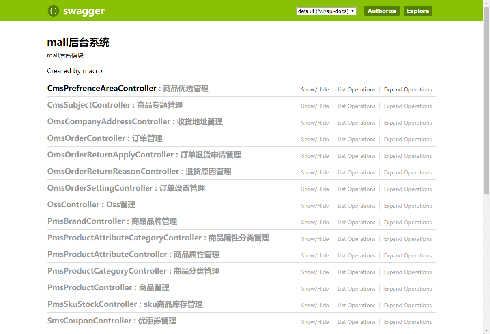
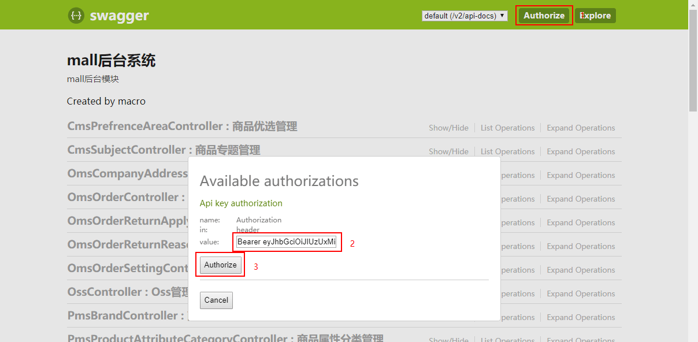
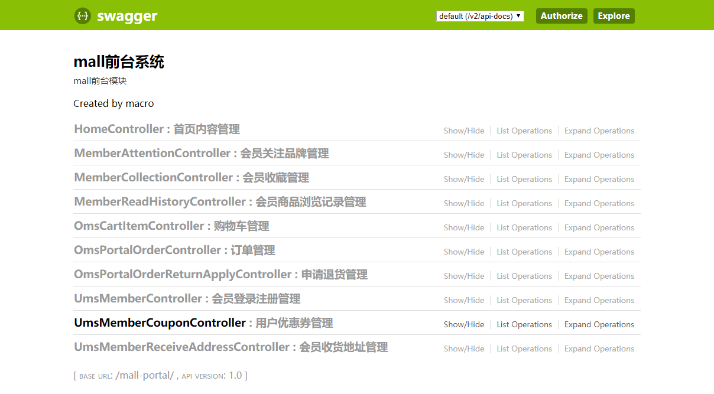
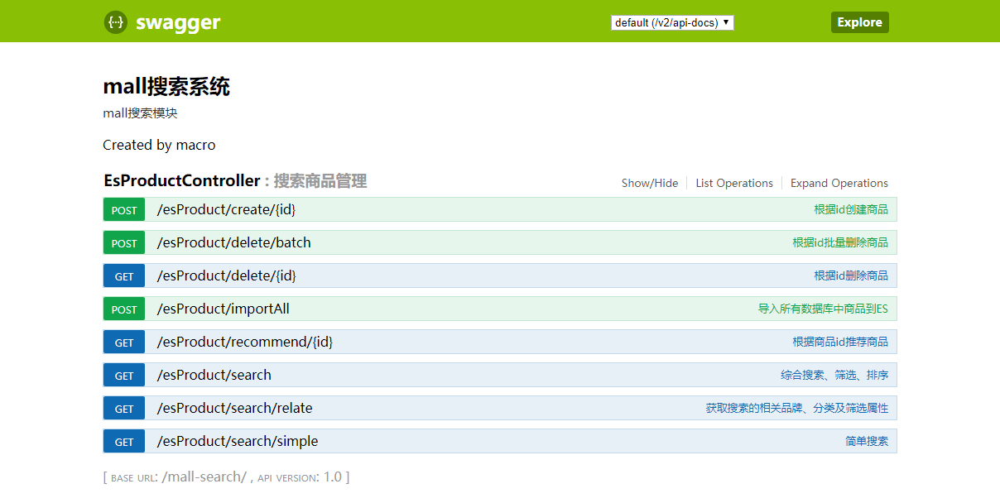
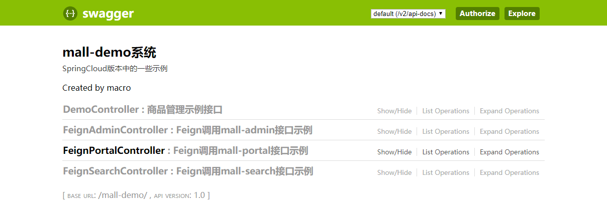
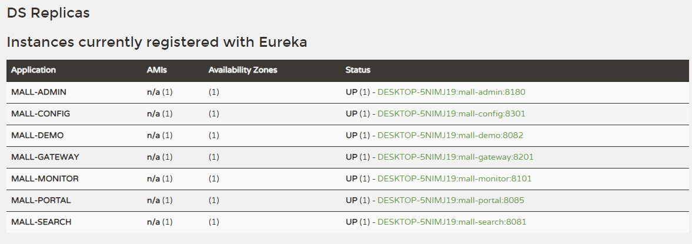
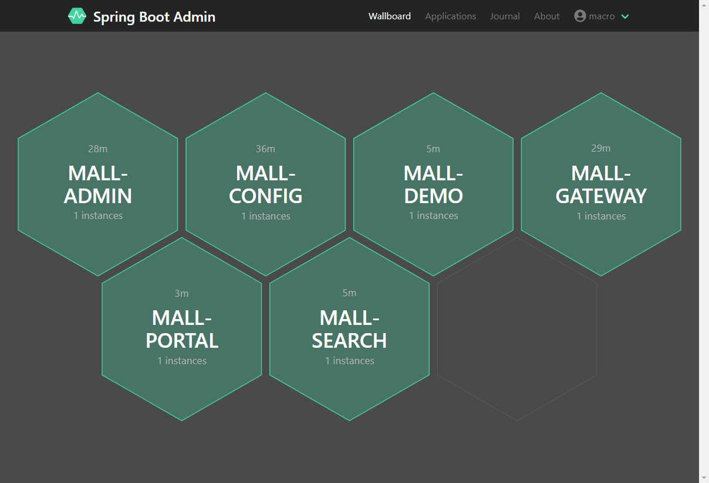
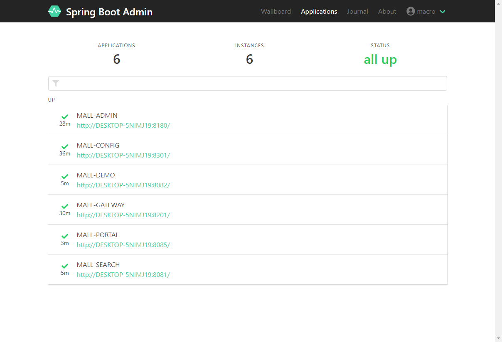
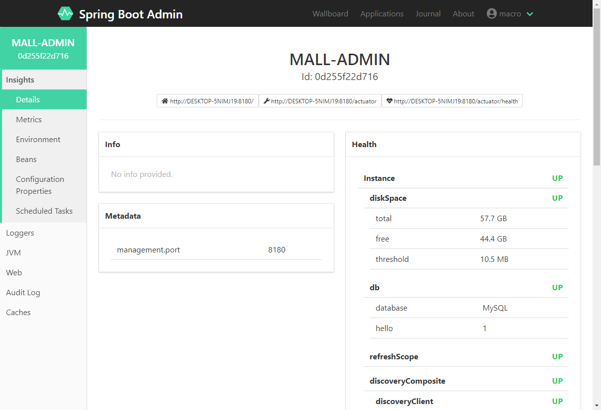
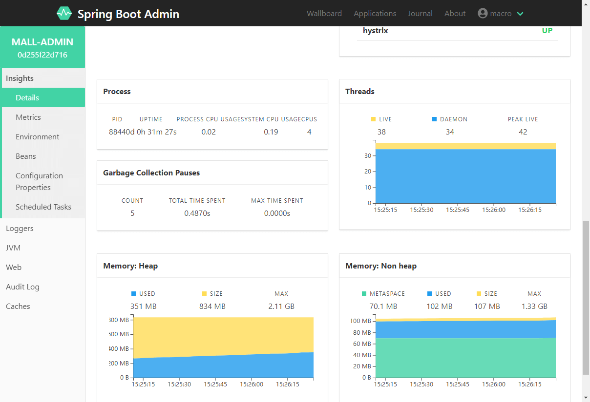

# mall-swarm Deployment on Windows

## Development Environment Setup

> The environment used in `mall-swarm` is roughly the same as in the `mall` project. Please refer to [mall Deployment on Windows](https://github.com/macrozheng/mall-learning/blob/master/docs/deploy/mall_deploy_windows.md) for details.

Simple setup process:

- Install IDEA and import the project source code;
- Install MySQL, create a `mall` database, and import the `/document/sql/mall.sql` file;
- Install Redis, Elasticsearch, MongoDB, RabbitMQ, and other environments.

## Project Deployment

> The startup order of the `mall-swarm` project must be followed as shown below.

### Start the Registration Center `mall-registory`

- Directly run the main function of com.macro.mall.MallRegistryApplication;
- After running, view on the registry console: http://localhost:8001

### Start the Configuration Center `mall-config`

- Directly run the main function of com.macro.mall.MallConfigApplication;
- Access the following endpoint to get the mall-admin configuration in dev environment: http://localhost:8301/master/admin-dev.yml

### Start the Monitoring Center `mall-monitor`

- Directly run the main function of com.macro.mall.MallMonitorApplication;
- After running, view on the monitoring console: http://localhost:8101
- Login with username/password: `macro:123456`.

### Start the Gateway Service `mall-gateway`

- Directly run the main function of com.macro.mall.MallGatewayApplication;
- Access the endpoint to get dynamic route rules: http://localhost:8201/actuator/gateway/routes

### Start the Admin Service `mall-admin`

- Directly run the main function of com.macro.mall.MallAdminApplication;
- Access API documentation through `mall-gateway` gateway service: http://localhost:8201/mall-admin/swagger-ui.html

- Login API address: http://localhost:8201/mall-admin/admin/login
- After retrieving the token via the login API, add it to the authentication header to access other endpoints requiring login:

### Start the Portal Service `mall-portal`

- Directly run the main function of com.macro.mall.portal.MallPortalApplication;
- Access API documentation through `mall-gateway` gateway service: http://localhost:8201/mall-portal/swagger-ui.html

- Login API address: http://localhost:8201/mall-portal/sso/login
- The authentication approach for secured APIs is the same as for `mall-admin`.

### Start the Search Service `mall-search`

- Directly run the main function of com.macro.mall.search.MallSearchApplication;
- Access API documentation through `mall-gateway` gateway service: http://localhost:8201/mall-search/swagger-ui.html

### Start the Demo Service `mall-demo`

- Directly run the main function of com.macro.mall.MallAdminApplication;
- Access API documentation through `mall-gateway` gateway service: http://localhost:8201/mall-demo/swagger-ui.html

- You can use FeignAdminController, FeignPortalController, FeignSearchController to test remote calls using Feign.

## Preview

- Registry service information:

- Monitoring center overview:

- Monitoring center details for a single app:

